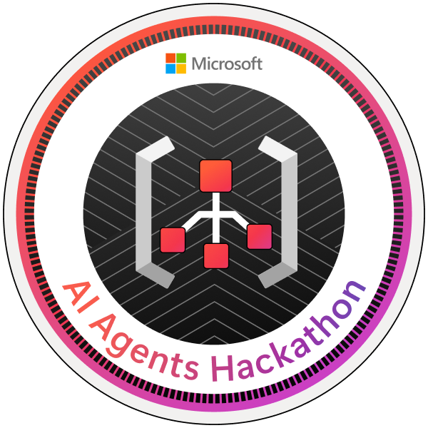
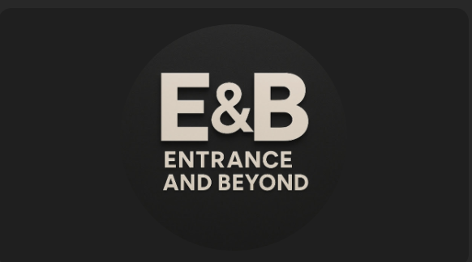

<!-- Animated Typing Banner -->
<!-- Animated Typing Banner -->

  

<h1 align="center">👋 Hey, I'm Aparimeya Tiwari</h1>

  🎓 Computer Science Student • 🤖 AI Explorer • 🎙️ Podcaster • 💡 Tech Dreamer

  
  
  

---

## 🚀 Featured Projects

### ⚖️ Lawgic (LawAgent)
A multilingual, AI-powered legal assistant for the Indian ecosystem.  
🧠 Uses NLP & LLMs to help users understand and interact with legal documents in multiple languages.  
💬 Designed with ethical AI principles and user accessibility at its core.  
🔗 [Watch the Demo](https://youtu.be/a1v9YRu0rsA?si=j2qVwgf2dhAwzGnc)

---

### 🎙️ AI Podcast Question Generator
Analyzes resumes, LinkedIn profiles, and transcripts to auto-generate smart, personalized podcast questions.  
🧩 Built using a custom-trained LLM pipeline with Flask & OpenAI APIs.  
🎯 Created for hosts who want meaningful conversations without manually prepping!  
🔗 [LinkedIn Demo](https://www.linkedin.com/posts/aparimeya-tiwari-76a252252_ai-podcasttech-flask-activity-7295121244184571905-UpkG)  
📺 [YouTube Demo](https://youtu.be/gjWOJteTW6M?si=gJXdZT0cKq_LC5Gt)

---

### 🛡️ ProctoCam – AI-Powered Online Proctoring
A computer vision-based exam monitoring system that flags suspicious activity in real-time.  
📹 Uses OpenCV to track face position, detect extra persons, and background noise.  
🔒 Provides alerts and generates session reports to maintain exam integrity.  
🛠️ Built with Python, Flask, and face detection models — designed to be lightweight and scalable.

---

## 🏅 Certification

---

## 🎙️ Podcast & YouTube

  

  <h3><strong>Entrance & Beyond</strong></h3>
  
✨ Real talk around education, tech, student journeys, and leveling up.

  

---

## 🧠 Tech Stack & Tools

  
  
  
  
  
  
  
  

---

## 📈 GitHub Stats

  
   
  

---

## 📫 Let's Connect

  
  
  

---

## ✨ Fun Stuff

- 🎤 Podcasting is my escape. Nothing beats a good mic and deep convos.
- 💡 I love solving real-world problems using AI, especially with ethical, usable designs.
- 🏏 Big-time MS Dhoni & Tom Brady fan — clutch mindset always.
- 🎶 Music + coding = focus mode unlocked.

---

> _"Chasing curiosity, building impact, and sharing stories along the way."_  
> _Let’s build something that matters 🚀_
